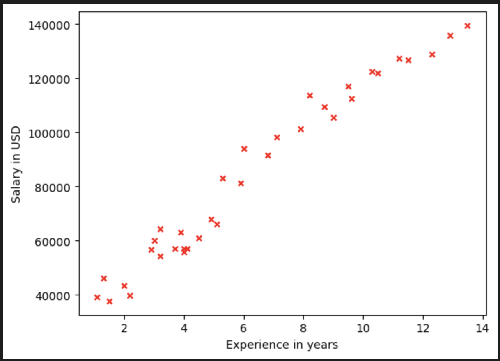
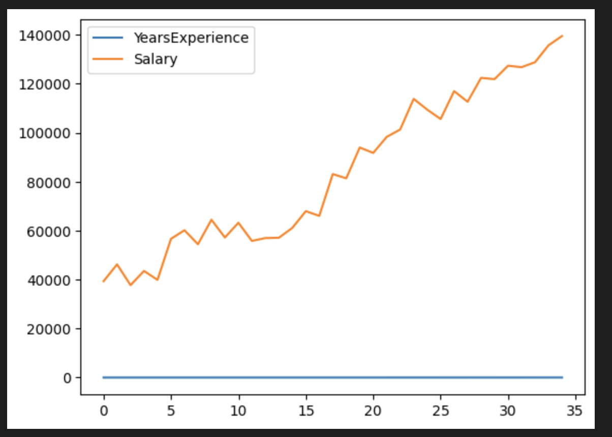
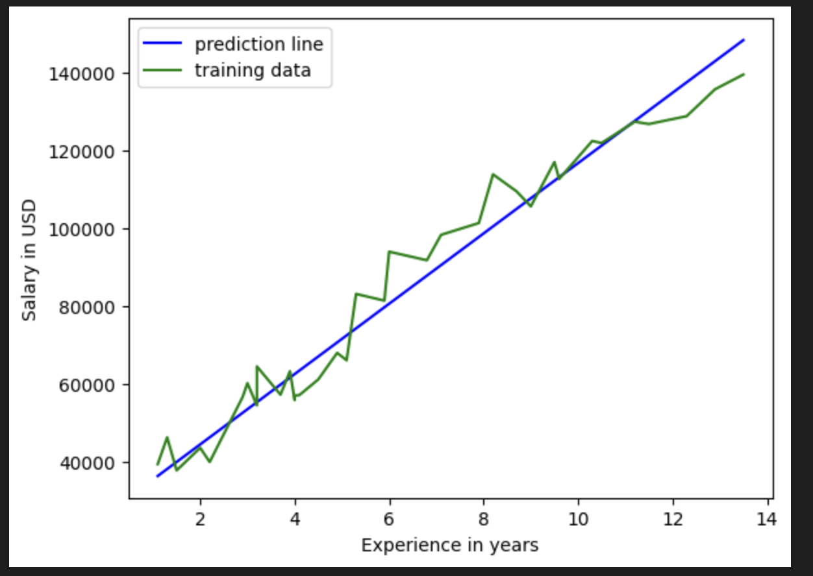

# Salary Prediction

## Overview
This project aims to predict salaries based on years of experience using machine learning techniques. It utilizes a dataset containing information about the years of experience, and corresponding salaries to train a model that can predict the salary of any arbitrary years of experience.

## Dataset
The dataset used in this project is a CSV file named [`salary.csv`](https://github.com/ShishirRijal/Salary-Prediction/blob/main/salary.csv), which contains the following columns:
- `YearsExperience`: The number of years of experience.
- `Salary`: The corresponding salary.


## Getting Started

### Prerequisites
- Python 3.x
- Jupyter Notebook
- Pandas
- Numpy
- Matplotlib

You can install the necessary packages using pip:
```bash
pip install jupyter pandas numpy matplotlib 
```

#### 1. Installation
```bash
git clone https://github.com/ShishirRijal/Salary-Prediction.git
```

#### 2. Open project in Jypyter Notebook
```bash
jupyter notebook
```
##### 3. Navigate to the project directory and open the SalaryPrediction.ipynb file.
<br>

### Usage
To utilize the Salary Prediction model, follow the steps below:

1. **Data Preprocessing:**
   - Ensure the data is cleaned and preprocessed.
   - Handle any missing or outlier values.

2. **Model Training:**
   - Run the Jupyter Notebook [`SalaryPrediction.ipynb`](https://github.com/ShishirRijal/Salary-Prediction/blob/main/SalaryPrediction.ipynb) to train the model.
   - Validate the model using a validation dataset to ensure its predictive accuracy.

3. **Prediction:**
   - Use the trained model to predict salaries based on the input features (e.g., years of experience).

4. **Visualization:**
   - Visualize the results using plots and graphs to understand the model performance and predictions.

<br>


### Model
In this project, a linear regression model is utilized to predict the salary based on years of experience.

<br>

### Results
The results section will showcase the performance of the model through various metrics and visualizations. It will include:

- **Model Accuracy:** The trained model can predict the salary of professionals according to their experience with an average accuracy of <strong> 93%</strong>.

- **Visualizations:** Graphs showing the actual vs. predicted salaries.
 



### Contributing
Contributions to enhance the Salary Prediction model are welcomed! Here's how you can contribute:

1. **Fork the Repository:** Fork the [Salary Prediction](https://github.com/ShishirRijal/Salary-Prediction) repository to your GitHub account.
2. **Clone the Repository:** Clone the forked repository to your local machine.
3. **Create a New Branch:** Create a new branch for your feature or bug fix.
4. **Commit Your Changes:** Make and commit your changes to the new branch.
5. **Push to GitHub:** Push your changes to GitHub.
6. **Submit a Pull Request:** Submit a pull request to merge your changes to the main branch.

Ensure to pull the latest version from the main branch before creating a new feature branch to avoid any merge conflicts.


 
